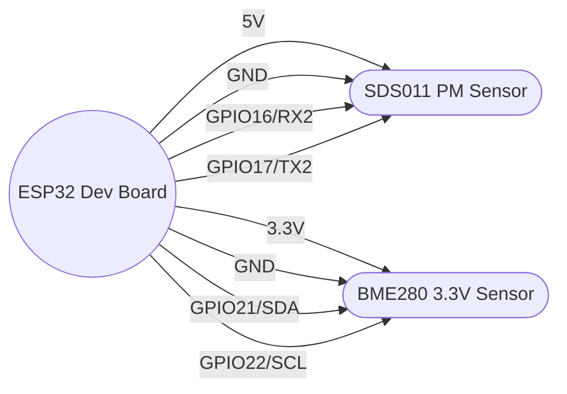

# Wiring and Breadboard Diagram

## Pin map

| Component | Pin | ESP32 Pin | Notes |
|---|---|---|---|
| SDS011 | 5V | 5V | Power from USB 5V on ESP32 dev board |
| SDS011 | GND | GND | Common ground |
| SDS011 | TX | GPIO16 (RX2) | Sensor TX -> ESP32 RX |
| SDS011 | RX | GPIO17 (TX2) | Sensor RX <- ESP32 TX |
| BME280 (3.3V) | VCC | 3.3V | Do not power from 5V |
| BME280 (3.3V) | GND | GND | Common ground |
| BME280 (3.3V) | SDA | GPIO21 | I2C SDA |
| BME280 (3.3V) | SCL | GPIO22 | I2C SCL |

If your BME280 uses address 0x77 instead of 0x76, update `address` in `firmware/esphome/air_monitor.yaml`.

## Breadboard layout (text)

1. Place the ESP32 across the center gap of the breadboard.
2. Connect ESP32 `5V` to the red (+) rail and `GND` to the blue (-) rail.
3. Connect ESP32 `3.3V` to a separate red (+) rail (or mark it clearly).
4. Wire SDS011:
   - `5V` to the 5V rail
   - `GND` to ground rail
   - `TX` to `GPIO16`
   - `RX` to `GPIO17`
5. Wire BME280:
   - `VCC` to 3.3V rail
   - `GND` to ground rail
   - `SDA` to `GPIO21`
   - `SCL` to `GPIO22`

## Mermaid diagram (logical)

## Notes
- Use short jumper wires and avoid routing the SDS011 cable near noisy power supplies.
- The SDS011 fan inlet/outlet should be unobstructed.
